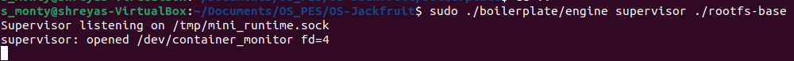
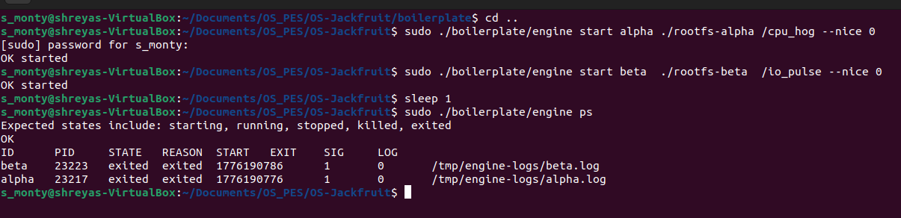
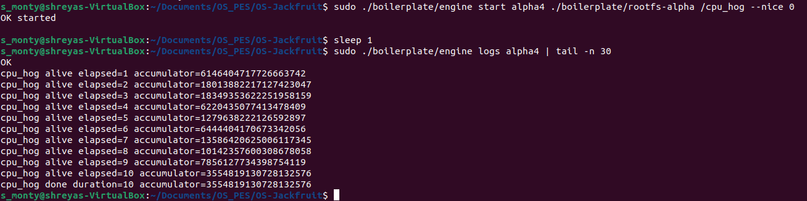
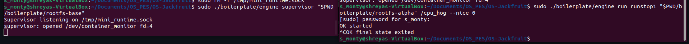
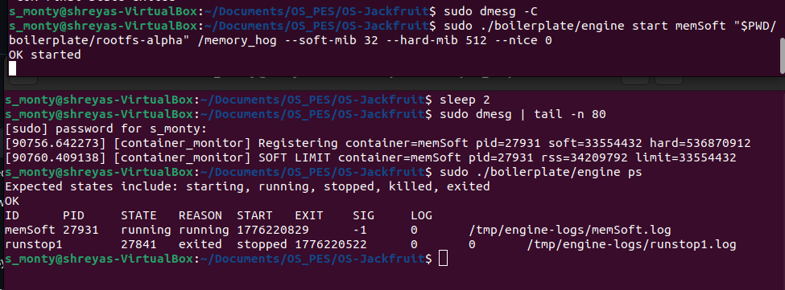
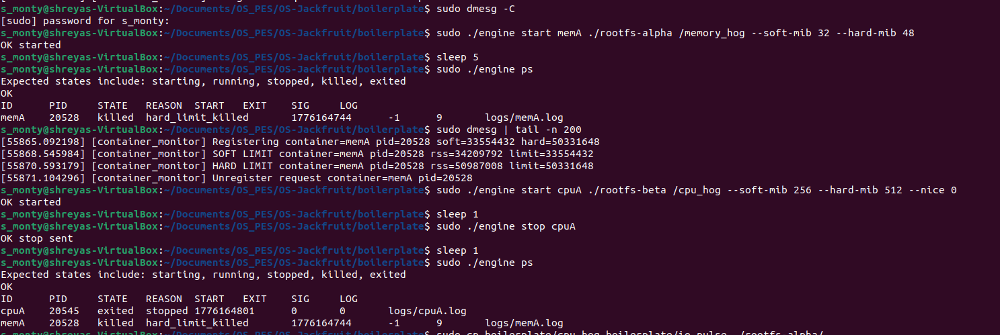
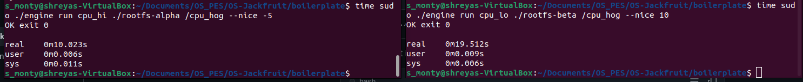
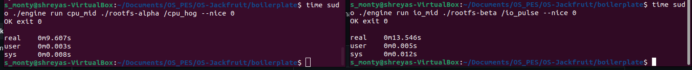
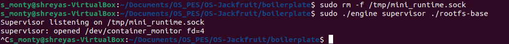
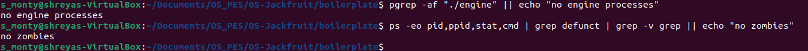

# OS Jackfruit — Mini Container Runtime (OS Project)

**Team**
- Shreyas Mohanty — PES2UG24CS491  
- Shreya Ajith — PES2UG24CS480  

This repository implements a mini container runtime with a long-running supervisor, CLI control plane over a UNIX domain socket, per-container logging, and a kernel monitor module for enforcing soft/hard memory limits.

> **Note on layout:** All implementation and build artifacts live in `boilerplate/`. The repo root `Makefile` forwards to `boilerplate/` so that `make` works from the top level.

---

## 0) Quick Start (Build + Run)

### Build (from repo root)
```bash
make
make ci
make clean
```

(Equivalent explicit form used by the guide)
```bash
make -C boilerplate
make -C boilerplate ci
make -C boilerplate clean
```

### Load the kernel module
```bash
sudo rmmod monitor 2>/dev/null || true
sudo insmod boilerplate/monitor.ko
ls -l /dev/container_monitor
```

### Prepare rootfs copies (recommended)
We create two independent rootfs copies so multiple containers can run concurrently without stepping on each other.

```bash
sudo rm -rf rootfs-alpha rootfs-beta
cp -a rootfs-base rootfs-alpha
cp -a rootfs-base rootfs-beta

# Copy workloads into both rootfs copies (built in boilerplate/)
sudo cp boilerplate/cpu_hog boilerplate/io_pulse boilerplate/memory_hog rootfs-alpha/
sudo cp boilerplate/cpu_hog boilerplate/io_pulse boilerplate/memory_hog rootfs-beta/
sudo chmod +x rootfs-alpha/cpu_hog rootfs-alpha/io_pulse rootfs-alpha/memory_hog
sudo chmod +x rootfs-beta/cpu_hog  rootfs-beta/io_pulse  rootfs-beta/memory_hog
```

### Start the supervisor
In terminal 1:
```bash
sudo rm -f /tmp/mini_runtime.sock
sudo ./boilerplate/engine supervisor ./rootfs-base
```

### Use the CLI (examples)
In terminal 2:
```bash
sudo ./boilerplate/engine ps
sudo ./boilerplate/engine start c1 ./rootfs-alpha /cpu_hog --nice 0
sudo ./boilerplate/engine start c2 ./rootfs-beta  /io_pulse --nice 0
sudo ./boilerplate/engine ps
sudo ./boilerplate/engine logs c1
sudo ./boilerplate/engine stop c1
sudo ./boilerplate/engine stop c2
```

---

## 1) CLI Commands Supported

- `supervisor <rootfs-base>`
- `run <id> <rootfs> <command> [--soft-mib N] [--hard-mib N] [--nice N]`
- `start <id> <rootfs> <command> [--soft-mib N] [--hard-mib N] [--nice N]`
- `ps`
- `logs <id>`
- `stop <id>`

**Logging location:** container logs are written under:
- `/tmp/engine-logs/`

---

## 2) Screenshot / Evidence Checklist (as required by the guide)

Add screenshots to a folder (for example `screenshots/`) and paste them into your final submission (PDF or README, depending on course instructions).

1. **Supervisor running + CLI connects** (shows socket-based IPC works)

2. **Metadata tracking (`ps`)** with multiple containers

3. **Bounded-buffer logging** (show `logs <id>` output and that logs are continuously produced/consumed)

4. **CLI signal forwarding in `run`** (Ctrl+C causes stop request, client keeps waiting and prints final status)

5. **Soft limit exceeded** (kernel `dmesg` warning once, container continues)

6. **Hard limit exceeded** (container SIGKILL) + `ps` shows `REASON=hard_limit_killed`

7. **Scheduling experiments** (nice levels) with concurrent workloads + timing


8. **Clean teardown** (no zombies after supervisor exits)



---

## 3) Design Overview (What We Implemented)

### Task 1 — Multi-container Runtime + Namespaces
- A long-running supervisor manages multiple containers concurrently.
- Each container is created with Linux namespaces (PID, mount, UTS, etc. as implemented).
- Each container uses its own rootfs directory (e.g., `rootfs-alpha`, `rootfs-beta`).

### Task 2 — Control Plane over UNIX Domain Socket
- CLI commands talk to the supervisor using a UNIX domain socket (`/tmp/mini_runtime.sock`).
- The `run` command blocks until the container finishes.
- **Signal handling requirement:** if the `run` client receives SIGINT/SIGTERM (e.g., Ctrl+C), it sends `stop <id>` to the supervisor and continues waiting for final completion status.

### Task 3 — Bounded-buffer Logging Pipeline
- Each container has a per-container log file.
- Output is collected and written by a producer/consumer style pipeline with a bounded buffer to avoid unbounded memory growth.
- Logs are stored under `/tmp/engine-logs/`.

### Task 4 — Kernel Monitor (Soft/Hard Memory Limits)
- At container start, the supervisor registers a container PID + memory limits to the kernel monitor device.
- **Soft limit:** kernel prints a warning (once) when RSS exceeds soft threshold.
- **Hard limit:** kernel sends SIGKILL when RSS exceeds hard threshold.
- **Attribution rule implemented:**  
  - if SIGKILL occurs **without** a prior user stop request → `REASON=hard_limit_killed`
  - if container was stopped via the runtime → `REASON=stopped`

### Task 5 — Scheduler Experiments
We included workloads:
- `cpu_hog` (CPU-bound)
- `io_pulse` (I/O-oriented with sleeps and bursts)
- `memory_hog` (memory pressure for soft/hard testing)

We ran experiments using `--nice` to demonstrate scheduling effects under contention.

### Task 6 — Cleanup / Teardown
- Supervisor shutdown leaves **no zombies**.
- Containers are reaped properly.
- Log pipeline threads terminate cleanly.

---

## 4) Scheduling Experiments (Results + Notes)

### Experiment A — Two CPU-bound containers concurrently (different nice)
Commands (two terminals):
```bash
time sudo ./boilerplate/engine run cpu_hi ./rootfs-alpha /cpu_hog --nice -5
time sudo ./boilerplate/engine run cpu_lo ./rootfs-beta  /cpu_hog --nice 10
```

Observed wall-clock times (concurrent run):
- `cpu_hi` (nice -5): **~10.0s**
- `cpu_lo` (nice 10): **~19.5s**

**Interpretation:** With both contending for CPU, the scheduler favors the lower nice (higher priority) process, reducing its completion time significantly.

### Experiment B — CPU-bound vs I/O-oriented concurrently (nice 0)
Commands (two terminals):
```bash
time sudo ./boilerplate/engine run cpu_mid ./rootfs-alpha /cpu_hog --nice 0
time sudo ./boilerplate/engine run io_mid  ./rootfs-beta  /io_pulse --nice 0
```

Observed wall-clock times:
- `cpu_mid`: **~9.6s**
- `io_mid`: **~13.5s**

**Interpretation:** `io_pulse` intentionally sleeps between bursts and calls `fsync`, so total wall time is higher. During the run, it remains responsive (periodic output), illustrating different behavior from a CPU-bound workload under scheduling.

---

## 5) Engineering Analysis (Guide-required Topics)

### A) Concurrency model
- Supervisor handles multiple containers concurrently.
- Logging uses threads with a bounded buffer (producer/consumer) to decouple container output from disk writes.

### B) Failure handling
- CLI returns explicit `OK` / `ERR` responses from the supervisor.
- Container exit is tracked with exit code or signal.
- Monitor registration/unregistration is best-effort to avoid deadlock during teardown.

### C) Resource accounting and memory safety
- Bounded buffer prevents unbounded growth in userspace logging.
- Kernel monitor enforces memory constraints at runtime.

### D) Signal handling semantics
- User-issued `stop` sends SIGTERM then SIGKILL as a fallback.
- `run` client forwards Ctrl+C into `stop` and still waits for the final container status, matching the guide requirement.

### E) Performance considerations
- Logging is buffered to reduce syscall overhead.
- Nice-based experiments show predictable prioritization effects under CPU contention.

---

## 6) Notes / Repro Tips

- If `/tmp/mini_runtime.sock` exists from an earlier run, remove it before starting the supervisor:
  ```bash
  sudo rm -f /tmp/mini_runtime.sock
  ```
- If the monitor device is missing:
  ```bash
  sudo insmod boilerplate/monitor.ko
  ls -l /dev/container_monitor
  ```
- To clear old runtime logs:
  ```bash
  sudo rm -rf /tmp/engine-logs
  ```
